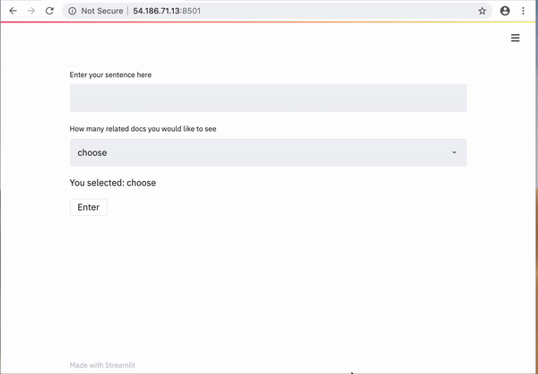
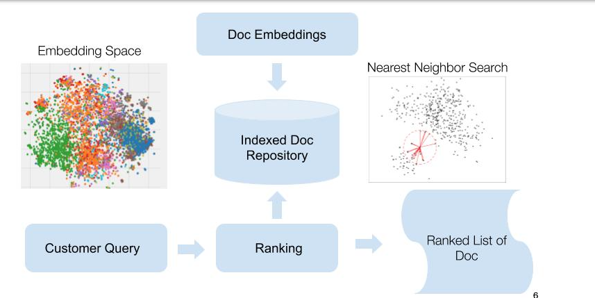

# Sentence Embedding for Document Ranking
This repository contains the implelentation of building a document ranking system using the sentence embeddings tailored for your domain specific corpora. 

It allows to you to train the sentence embedding system on your own unique corpus, create your own indexed document reposistory and buid a ranking system to output the top K most similar/relavant docs for a given input query.


## Demo:



## Getting Started:
Clone this reposistory locally
```
git clone https://github.com/ffangsong/Sentence_Embedding_for_Ranking.git
cd Sentence_Embedding_for_Ranking
```

Create the environment from the the provided requirement.txt file

    conda create python=3.6
    pip install -r requirement.txt
    
Make sure you have dataset in the ```data``` folder(you can specify the path in the train script later)    

## Architecture




## Embedding Model Details

For emebedding model, I used transfer learning to leverage the pretrained models which has been trained with huge amounts of general language data prior to being released:
* The first model leverages pretrained word embedding, then use a LSTM layer to capture the contexual information and thus a  richer semantic representation. 
* The second model leverages pretrained BERT model, a deep bidirectional transformer.  The BERT layer  was initialized with the pre-trained weights, followed by a pool layer, and the weights were fine-tuned for the domain specific corpus during training. 

I restricted the classification to rely on a simple cosine similarity metric to compel the model to learn a better text representation.

After the training is done, the classification layer is dropped and the output of the 2nd last is used as the text embedding. 

## Train the Embedding model
* To train the word2vec_LSTM model, please download Google's pretrained model [here](https://s3.amazonaws.com/dl4j-distribution/GoogleNews-vectors-negative300.bin.gz) and put in the ```docs/pretrained``` folder. To start training:
```
cd src/
python word2vec_LSTM_train.py
```

* To fine tune the Bert model, please download pretrained Bert model [here](https://storage.googleapis.com/bert_models/2018_10_18/uncased_L-12_H-768_A-12.zip), unzip it and put in the ```docs/pretrained```. To start training

```
cd src/
python bert_fine_tune_train.py
```
After training, the checkpoints will be saved at ```docs/model_checkpoint/```

## Document Indexing 

To generate the index, please put your docs at```data/ ```  and run:
```
python src/encoder.py
python src/indexing.py
```
The index will be saved at ```docs/ ```


## Run Ranking test

To run test on the ranking application, please run:
```
python src/ranking.py
```
The application will output the top 3 most relevant docs for a given input query.

## More information about Word2Vec and BERT
Google's pretrained word2vec model includes word vectors for a vocabulary of 3 million words and phrases that they trained on roughly 100 billion words from a Google News dataset. The vector length is 300.

BERT builds on top of a number of clever ideas that have been responsible for many of the recent advances in NLP, including the transformer architecture and semi-supervized pre-training.  It is pre-trained on two tasks: masked language modeling and next sentence prediction, with large set of text data(books, wikipedia, ect).  It has language processing abilities capable of empowering many models we later need to build and train in a supervised way.  
